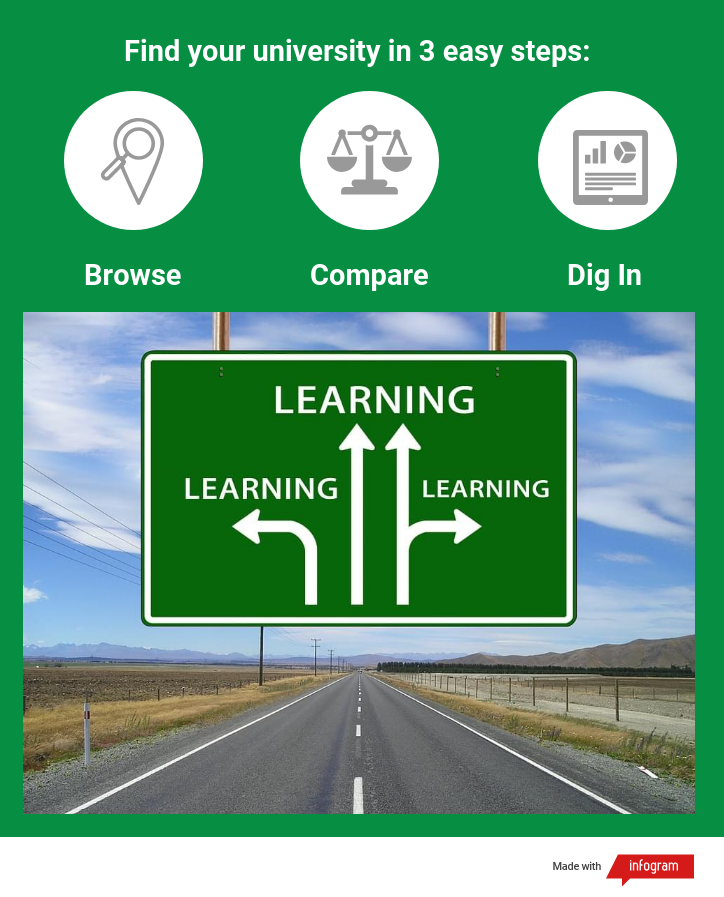

# Project 2: Shiny App Development Version 2.0

### [Project Description](doc/project2_desc.md)



In this second project of GR5243 Applied Data Science, we develop a version 2.0 of an *Exploratory Data Analysis and Visualization* shiny app on a topic of your choice using [NYC Open Data](https://opendata.cityofnewyork.us/) or U.S. government open data released on the [data.gov](https://data.gov/) website. See [Project 2 Description](doc/project2_desc.md) for more details.  

The **learning goals** for this project is:

- business intelligence for data science
- study legacy codes and further development
- data cleaning
- data visualization
- systems development/design life cycle
- shiny app/shiny server

*The above general statement about project 2 can be removed once you are finished with your project. It is optional.
All
## Project Title: University Hacker - Find Your University in 3 Easy Steps
Term: Spring 2019

### Team # 4
- Elena Dubova
- Ying Jin
- Xuewei Li
- Yun Zhang

### Project summary 

**University Hacker** is an application for a wide range of potential college applicants - from high-school graduates to college students - who look for an easy and guided way to navigate university landscape of the United States. Most applications provide all sorts of information and functionality but lack systematic approach and intuitive instructions. Sometimes, on the contrary, instructions to the application might be a whole page of text; it repulses many users, especially younger generation. The central idea of "University Hacker" design is to provide appealing methodology of university search along with seamless user experience. Structure of the application divides the journey to one's desired university into three big steps:

- Step 1: "Browse" *(helicopter view of the university landscape with no extra details)*
- Step 2: "Compare" *(focus on differences between a few options identified in the first step)*
- Step 3: "Dig In" *(detailed insights about one university of choice)*
       
Thus, user navigates easily from **"Few Details - Many Universities"** to **"Many Details - Few Universities"** based on his/her interests and aspirations. This process can be iterative but is not tedious thanks to very simple navigation logic. 

### Contribution statement 

- Elena Dubova: Set up the structure of the whole app, and do the Step 1.
- Ying Jin: Improve UI part for Step 2 and Step 3, help with Step 2.
- Xuewei Li: Merge the ranking and basic data of 10 years, do the Step 3.
- Yun Zhang: 

Following [suggestions](http://nicercode.github.io/blog/2013-04-05-projects/) by [RICH FITZJOHN](http://nicercode.github.io/about/#Team) (@richfitz). This folder is orgarnized as follows.

```
proj/
├── app/
├── lib/
├── data/
├── doc/
└── output/
```

Please see each subfolder for a README file.

